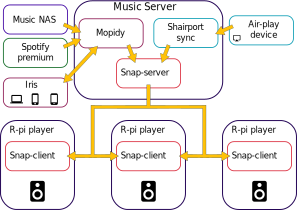

# Multi-zone music set up // SONOS killer

## Inspiration

I wanted to replace my sonos system with something I controlled, and open source. This was after sonos EOL'ed my play 5 which was a birthday present 4 years earlier which is in my opinion a not very good life span for a £400 speaker. At the time of buying sonos was a very unique offering but now it is possible to replicate the features by using raspberry pis, DAC hats or AMP hats, and active or passive speaker systems which will never reach the end of life until you decide. It also means you can replace components when you need to rather than the whole system or whole speaker. You can also start with some old speakers then upgrade them when you have the resources to.
I searched for a way to do this and came accross some people who had tried a similar system:

- https://www.home-assistant.io/blog/2016/02/18/multi-room-audio-with-snapcast/
- http://www.hietala.org/multi-room-audio-with-mpd-and-snapcast.html
- https://github.com/skalavala/Multi-Room-Audio-Centralized-Audio-for-Home
- https://webworxshop.com/multi-room-audio-system-indoor-and-outdoor-audio-with-snapcast-and-mopidy/
- http://www.ludwikowski.info/2017/11/multiroom-with-raspberry-pi-snapcast.html
- https://www.technicallywizardry.com/audio-control-diy-stereo-system/

This set up is based around these set ups along with the other resources I list at each point.

## Requirements

- [x] Play music from spotify, local library, radio stations, and air play from phone
- [x] Play music through multiple 'zones' and sync the audio to each
- [x] Easily controlled from a nice UI
- [x] Easily add new 'zones'
- [ ] Easily control which 'zone' is playing what
- [x] Open source software, run locally

## Contents

1. [Setup](https://github.com/asymy/multi-zone-music/blob/master/01_Initial_setup.md)
2. [Mopidy](https://github.com/asymy/multi-zone-music/blob/master/02_Mopidy.md)
3. [Shairport](https://github.com/asymy/multi-zone-music/blob/master/03_Shairport.md)
4. [Snapserver](https://github.com/asymy/multi-zone-music/blob/master/04_Snapserver.md)
5. [Snapclient](https://github.com/asymy/multi-zone-music/blob/master/05_Snapclient.md)
6. [Home-assistant](https://github.com/asymy/multi-zone-music/blob/master/06_Homeassistant.md) (To Do)

# Conclusions

- We can now play music from spotify, our local files and also airplay to our speakers which are located in different rooms. Iris integrates all the sources and has a nice UI. New zones can be easily added with raspberry pis and all with open source projects.
- The only thing that is lacking is more easy control over groups. Iris has some control but it is burried in settings and also doesnt get named nicely.
- The way I work around this is by muting rooms I dont want to have playing. This is okay for me since I live alone but could be a problem for others.